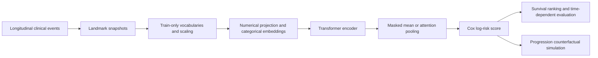

# Counterfactual Disease Progression Simulation with Survival Transformers

[](https://github.com/BestYlay/Model-based-Simulation-Framework/actions/workflows/tests.yml)
[](https://www.python.org/)
[](LICENSE)

This repository is a research prototype for modeling longitudinal cancer events with an
encoder-only Transformer and simulating how predicted survival risk changes when a disease
progression event is altered. It was originally developed for the project:

> A Model-based Simulation Framework for Uncovering the Context-Dependent Impact of Disease
> Progression in Breast Cancer

The portfolio refresh keeps the original notebooks as research records and adds a small,
tested Python package that can be reviewed and run without access to clinical data.

## What this project demonstrates

- Longitudinal clinical event modeling with mixed numerical and categorical features
- Landmark survival dataset construction without future-event leakage
- A PyTorch Transformer encoder with explicit padding masks and masked sequence pooling
- A numerically stable Cox partial-likelihood objective with Breslow tie handling
- Leak-resistant categorical vocabularies and numerical scaling
- Model-based counterfactual analysis for progression events
- Reproducible testing, synthetic smoke runs, and GitHub Actions CI

## Architecture



Each `SAMPLE_ID` is one patient history observed up to a landmark time. The model encodes the
ordered event sequence and produces a scalar log-risk score. Counterfactual analysis compares
the prediction before and after changing a selected progression event; it is model sensitivity
analysis, not a causal treatment-effect estimate.

## Quick start with synthetic data

The smoke demo creates a small longitudinal dataset, constructs landmark samples, trains the
Transformer, and generates validation risk scores.

```bash
python -m venv .venv
# Windows: .venv\Scripts\activate
# macOS/Linux: source .venv/bin/activate
pip install -e .
python -m examples.quickstart --epochs 4 --device auto
```

Run the test suite:

```bash
python -m unittest discover -s tests -v
```

Optional research dependencies for notebooks, SHAP, Optuna, and time-dependent AUC:

```bash
pip install -e ".[analysis]"
```

## Repository layout

```text
survival_simulation/
  data.py                 landmarking, train-only preprocessing, sequence batching
  model.py                positional encoding, Transformer, stable Cox loss
  training.py             device handling, training, evaluation, prediction
examples/quickstart.py     end-to-end synthetic demonstration
tests/                     focused regression and model tests
Data/                      MSK-CHORD acquisition and SQLite preparation notes
train_and_analyze.ipynb    original training and interpretation workflow
optuna_transformer_0.ipynb original hyperparameter-search workflow
```

## Working with MSK-CHORD

The real-data workflow uses the public MSK-CHORD study hosted by cBioPortal. The dataset is not
redistributed here. Follow [Data/README.md](Data/README.md) to download the study, build the
SQLite views, export event tables, and create landmark samples.

The five modeled cohorts are breast cancer, colorectal cancer, non-small-cell lung cancer,
pancreatic cancer, and prostate cancer. The original analysis focuses on breast cancer.

## Important design choices

- Splits are patient-level so event rows from one patient cannot cross train/validation folds.
- Categorical vocabularies and numerical scalers are fitted on training data only.
- Sequence padding is represented by an explicit Boolean mask rather than inferred from a
  clinical feature.
- Landmark labels use residual follow-up time (`stop - entry - landmark`) and retain only events
  strictly before the prediction cutoff.
- The Cox objective uses `logsumexp` and handles tied event times with the Breslow approximation.

## Limitations

- The counterfactual component measures model response to an edited event history. It does not
  identify a causal effect and should not be used for clinical decision-making.
- External validation and prospective calibration are outside the scope of this prototype.
- Raw clinical data and trained model artifacts are intentionally excluded from version control.
- The original notebooks contain exploratory analysis; the tested package is the canonical
  reference for reusable model and data-pipeline behavior.

## License

Code is released under the [MIT License](LICENSE). MSK-CHORD data remain subject to the terms of
their original provider.
